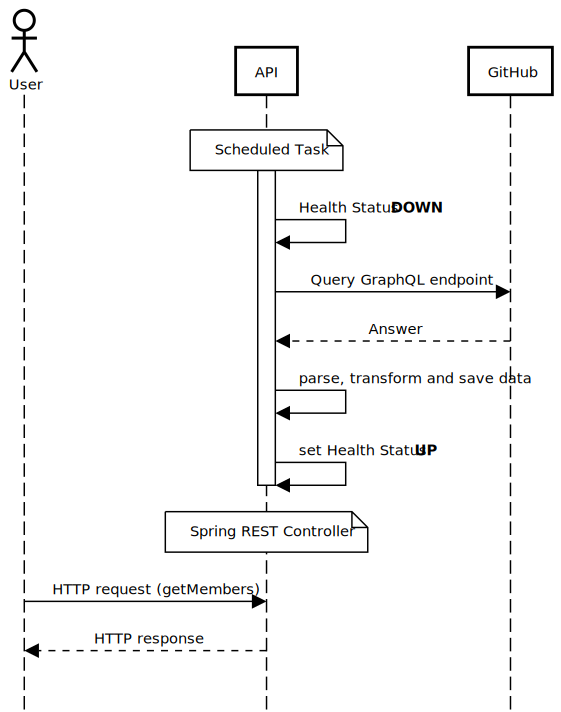

# Programming Languages API

The application provides a simple interface to unite the members of a GitHub organization, their repositories and the corresponding programming languages.
It should solve the problem of finding people within a GitHub organization that know a specific programming language.

## Demo

A video of the demo can be seen below.
During the startup an artificial delay of 15 seconds is used to download content from GitHub to show that the application is only ready once successful download from the GitHub API.
This is represented by the HTTP status code 503 when the endpoint to get all Members returns is being triggered while the application is still in Health Status "down".
After that, the data model is shown and the get Member functions are executed successfully, once without the language parameter and after that with different values.

https://github.com/niklaskeerl/programming-languages-api/assets/33728607/a79a8900-c35e-427c-bf76-a4718b21b2bd


## Run Locally

Install Java JDK 17.

Clone the project:

```bash
  git clone https://github.com/niklaskeerl/programming-language-api.git
```

Go to the project directory:

```bash
  cd programming-language-api
```

Package the application:

```bash
  ./mvnw clean package
```

Start the application:

```bash
  GITHUB_ACCESS_TOKEN=xxx_XXX java -jar programming-languages-api-1.0.0.jar
```

Access the Swagger UI [here](http://localhost:8080/swagger-ui/index.html).

The API reference can also be found in the OpenAPI v3 JSON format [here](http://localhost:8080/v3/api-docs).

## Quality Goals

The desired quality goals (according to ISO-25010) are:

1. **Performance efficiency (Resource utilization)**: Minimize egress traffic to reduce cloud costs.
2. **Reliability**: When the application is healthy, it should be considered to be usable by the user.
3. **Compatibility**: The application should be compatible with the offered APIs from GitHub.

## Architecture



The proposed solution is architected using the robust Java Spring Boot Framework.
Upon initialization of the Spring Boot web application, the Health Status is configured to a default "down" state.

Subsequently, a Spring Scheduled Task is initiated which fetches data from GitHub’s GraphQL endpoint.
This data retrieval is facilitated by the okhttp Java client, which sends an HTTP request.
The structure of the GraphQL query is as follows:

```
{
  organization(login: "codecentric") {
    membersWithRole(first: 36) {
      nodes {
        login
        contributionsCollection(organizationID: "O_kgDOAA9oNA") {
          commitContributionsByRepository(maxRepositories: 10) {
            repository {
              languages(first: 3, orderBy: {field: SIZE, direction: DESC}) {
                nodes {
                  name
                }
              }
            }
          }
        }
      }
    }
  }
}
```

The response from the GraphQL query is as follows:

```
{
 "data": {
  "organization": {
   "membersWithRole": {
    "nodes": [
     {
      "login": "username",
      "contributionsCollection": {
       "commitContributionsByRepository": [
        {
         "repository": {
          "languages": {
           "nodes": [
            {
             "name": "Java"
            }
           ]
          }
         }
        }
       ]
      }
     }
    ]
   }
  }
 }
}
```

The received response is parsed utilizing the gson library.
Following the parsing, the data is transformed to eliminate any empty elements and is then converted into the following Java Class:

```
public class OrganizationMember {
    @Schema(example = "example-user", description = "GitHub username")
    public String username;

    @Schema(example = "{\"TypeScript\":1,\"Java\":2,\"Dockerfile\":1,\"Shell\":1,\"Vue\":1}", description = "Map of programming languages and amount of projects using this language")
    public HashMap<String, Integer> programmingLanguages;

    public OrganizationMember(String username, HashMap<String, Integer> programmingLanguages) {
        this.username = username;
        this.programmingLanguages = programmingLanguages;
    }
}
```

After the transformation, the data is stored within a Spring Service Class.
Upon successful storage, the Health State is updated to ‘up’, indicating that the application is now ready to accept incoming requests.

The user interacts with the application by sending HTTP GET requests to the root (“/”) endpoint.
An optional parameter, language, can be included in the request to specify the programming language of interest.
The response to the user's request is a List of OrganizationMember objects.

In instances where the language parameter is utilized, the returned List of OrganizationMember objects is filtered based on the specified language.

The quality attribute of **Resource utilization** has been achieved by optimizing the data transmission process.
This is accomplished by sending a single HTTP request and subsequently transforming the data locally.

The quality attribute of **Reliability** is ensured through a robust setup process.
The application is designed to reach a healthy state only after the setup is successfully completed, thereby guaranteeing its ability to serve data to the user.

Lastly, the quality attribute of **Compatibility** is fulfilled by using the GraphQL API provided by GitHub, ensuring integration and interoperability using any public GitHub organization.

### Alternatives

#### Using the REST API

As an alternative to the GraphQL endpoint, a solution that uses the REST API can be considered.

This would involve the following steps:

1. Retrieve a list of all members by sending a HTTP GET request to https://api.github.com/orgs/codecentric/members.
2. Obtain all repositories by sending a HTTP GET request to https://api.github.com/orgs/codecentric/repos.
3. For each repository, determine the programming language by sending a HTTP GET request to https://api.github.com/repos/codecentric/<repo>/languages.
4. Identify the contributors of each repository by sending a HTTP GET request to https://api.github.com/repos/codecentric/<repo>/contributors.
5. Filter the obtained contributor list using the member list from step 1 to construct the data model.

This approach results in a higher number of requests.
Specifically, for each repository, two additional requests are required to acquire the contributors and languages.
Consequently, the **Resource utilization** quality goal would be compromised as more egress traffic needs to be sent.

However, it's important to note that the other two quality goals, **Reliability and Compatibility**, remain unaffected and continue to meet the set standards.

Given that this approach has a strong impact on the primary quality goal, this alternative was not implemented.

Using GraphQL, in comparison to using the REST API, we can send only one request to get all our desired information.
This approach means we can keep high standards across all the desired quality goals.
